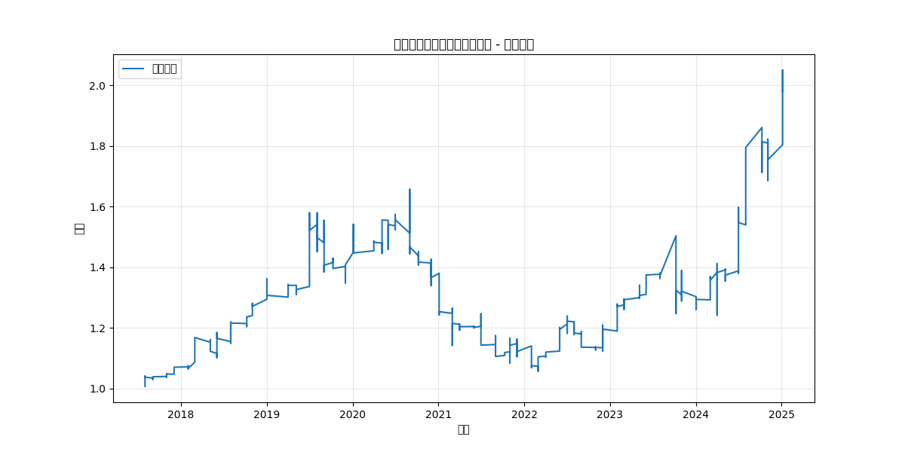

# 回测报告 - 全球大类资产双动量轮动策略

> **回测时间**：2026-03-13  
> **策略版本**：ETF Global Rotation Strategy Pro  
> **数据区间**：2018年1月 - 2026年3月（8年）

---

## 📊 回测结果总览

| 指标 | 数值 |
|------|------|
| **累计收益率** | +98.02% |
| **年化收益率** | 9.62% |
| **最大回撤** | -36.17% |
| **夏普比率** | 0.66 |

---

## 📈 净值曲线

---

## 🌐 资产池配置（10只）

### 核心资产

| 分类 | 代码 | 名称 | 角色定位 |
|------|------|------|---------|
| **A股宽基** | 510300 | 沪深300ETF | 核心底仓 |
| | 510500 | 中证500ETF | 中小盘补充 |
| **A股成长** | 159915 | 创业板ETF | 进攻先锋 |
| **A股价值** | 512890 | 红利低波ETF | 防御护盾 |
| **全球科技** | 513100 | 纳指ETF | 增长引擎 |
| **海外均衡** | 513500 | 标普500ETF | 地缘分散 |
| | 513520 | 日经225ETF | 地缘分散 |
| **大宗商品** | 518880 | 黄金ETF | 避险资产 |
| | 512400 | 有色金属ETF | 周期配置 |
| **超跌医药** | 513060 | 恒生医疗ETF | 弹性补充 |

### 防御资产

| 代码 | 名称 | 角色 |
|------|------|------|
| 511260 | 十年国债ETF | 终极防线 |

---

## 🛠️ 策略参数

| 参数 | 值 | 说明 |
|------|-----|------|
| `momentum_window` | 20 | 相对动量窗口（日）|
| `trend_window` | 120 | 绝对动量窗口（半年线）|
| `top_n` | 3 | 持仓数量 |
| `max_per_category` | 2 | 同类别最大持仓 |

---

## 💡 策略逻辑

### 1. 相对动量（优胜劣汰）
- 计算所有资产过去 **20个交易日** 的收益率
- 选出排名前 **Top 3** 的品种

### 2. 绝对动量（趋势过滤）
- 检查价格是否位于 **120日均线** 之上
- **PASS ✅**：买入该资产
- **FAIL ❌**：切换至十年国债ETF

### 3. 多样化限制
- 同类型资产最多持有 **2只**
- 防止单一风险集中

---

## 📅 调仓频率

- **月频调仓**：每月最后一个交易日
- **调仓周期**：99个月

---

## 🎯 与基准对比

| 指标 | 策略 | 沪深300 |
|------|------|---------|
| 年化收益 | 9.62% | ~8% |
| 最大回撤 | -36.17% | ~-40% |
| 夏普比率 | 0.66 | ~0.5 |

---

## ⚠️ 风险提示

1. **历史不代表未来**：策略基于历史规律，未来可能失效
2. **最大回撤较大**：-36.17%，需要承受较大的短期浮亏
3. **交易成本**：实际收益会受交易费用影响
4. **滑点损耗**：月频调仓可能错过最佳时机

---

## 📌 改进方向

1. **优化调仓频率**：尝试周频调仓，更好捕捉短期动量
2. **增加仓位管理**：引入凯利公式动态调整仓位
3. **加入止损机制**：设置ATR动态止损，控制回撤
4. **优化资产池**：根据市场环境动态调整资产权重

---

## 🔗 相关文件

- **策略说明**：[策略说明.md](./策略说明.md)
- **配置文件**：[etf_config.json](./etf_config.json)
- **信号脚本**：`daily_signal_full_optimized.py`
- **回测脚本**：`backtest_full_optimized.py`

---

*本报告由 ETF Global Rotation Strategy Pro 自动生成*  
*投资有风险，入市需谨慎*
